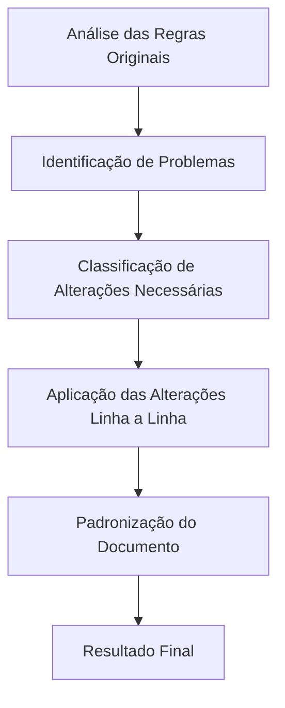
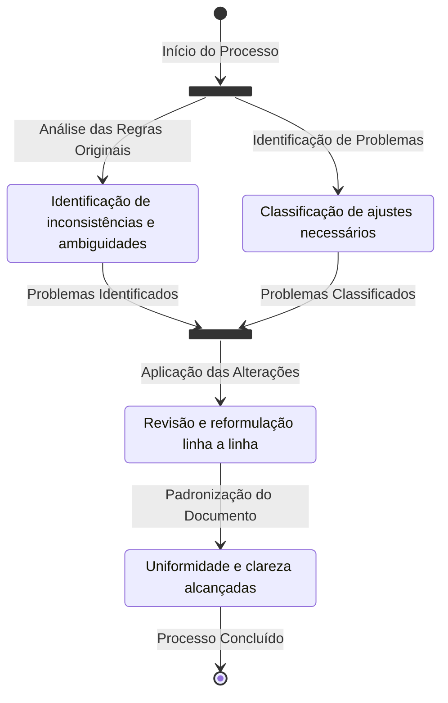

# Documentação Técnica das Regras

```{note}
Este documento detalha as alterações feitas nas regras, as práticas linguísticas aplicadas, as ferramentas utilizadas e o processo técnico seguido para padronizar e melhorar as regras do projeto.
```

---

## Ferramentas Utilizadas

- **Python**: Versão 3.10.6
- **Virtual Environment (venv)**: Configurado para isolar dependências do projeto.
- **MkDocs**: Ferramenta para geração de documentação estática.
- **MkDocs Material**: Tema utilizado para estilização e suporte a diagramas.
- **Extensões Markdown**:
  - `pymdownx.superfences`: Suporte para diagramas Mermaid.js.
  - `pymdownx.details`: Adição de detalhes expansíveis.
  - `pymdownx.emoji`: Suporte para emojis.

## Práticas de Linguagem Portuguesa Aplicadas

1. **Clarificação de Termos**:
   - Substituição de abreviações e gírias por termos formais (ex.: "pm" → "policiais em serviço").
   - Padronização de termos como "área safe" → "área segura".

2. **Padronização de Estrutura**:
   - Uniformização de tempos e medidas (ex.: "30 minutos a 6 horas").
   - Organização lógica das regras.

3. **Ajuste de Formalidade**:
   - Reformulação de frases para evitar ambiguidades.
   - Uso de linguagem direta e objetiva.

4. **Inclusão de Justificativas**:
   - Explicação técnica para cada alteração realizada.

## Processo de Modificação



### Etapas do Processo

1. **Análise das Regras Originais**:
   - Identificação de inconsistências e ambiguidades.

2. **Identificação de Problemas**:
   - Linguagem informal ou ambígua.
   - Falta de padronização em medidas e tempos.
   - Inconsistências nos termos utilizados.

3. **Classificação de Alterações Necessárias**:
   - Clarificação de termos.
   - Ajuste de formalidade.
   - Inclusão de justificativas.

4. **Aplicação das Alterações Linha a Linha**:
   - Revisão e reformulação de cada regra.
   - Manutenção de regras claras e corretas.

5. **Padronização do Documento**:
   - Uso de Markdown com estrutura consistente.
   - Uniformidade em todos os tipos de regras.

6. **Resultado Final**:
   - Regras claras, formais e padronizadas.
   - Fácil leitura e interpretação.
   - Compatível com integração em sistemas de RPG.

## Resultado

- **Regras Padronizadas**:
  - RP Criança, Facção, Corporação, Assaltos, Blitz, Perseguição, Emboscadas, entre outras.
- **Documentação Técnica**:
  - Estrutura clara e consistente.
  - Justificativas detalhadas para cada alteração.
- **Compatibilidade**:
  - Integração com Discord e sistemas de RPG.

---



---
